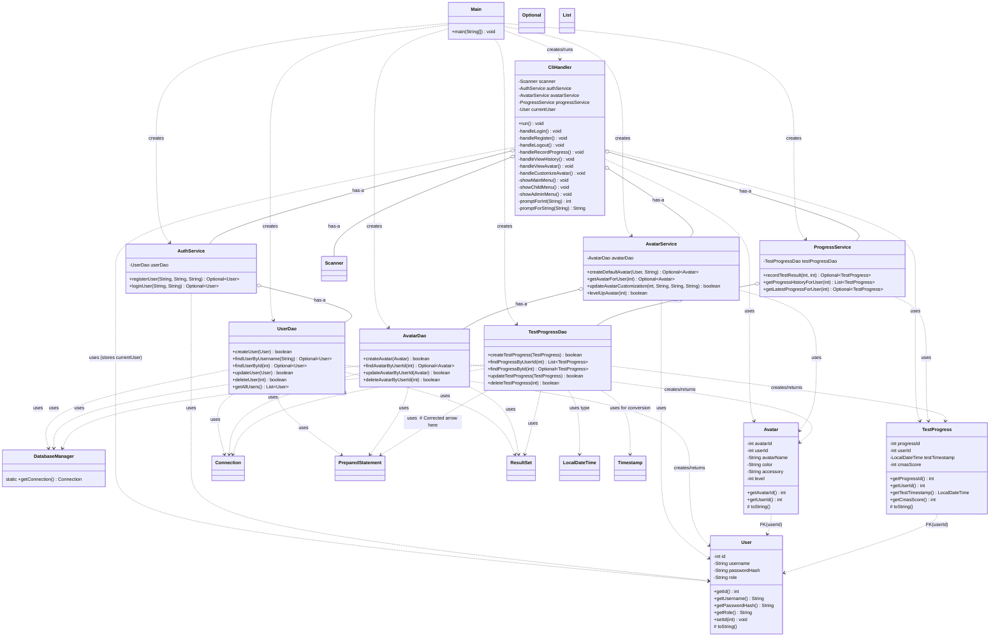

```mermaid
classDiagram
    %% --- Core Application Entry ---
    class Main {
        +main(String[]) void
    }

    %% --- Presentation Layer (CLI) ---
    class CliHandler {
        -Scanner scanner
        -AuthService authService
        -AvatarService avatarService
        -ProgressService progressService
        -User currentUser
        +run() void
        -handleLogin() void
        -handleRegister() void
        -handleLogout() void
        -handleRecordProgress() void
        -handleViewHistory() void
        -handleViewAvatar() void
        -handleCustomizeAvatar() void
        -showMainMenu() void
        -showChildMenu() void
        -showAdminMenu() void
        -promptForInt(String) int
        -promptForString(String) String
    }

    %% --- Service Layer (Business Logic) ---
    class AuthService {
        -UserDao userDao
        +registerUser(String, String, String) Optional~User~
        +loginUser(String, String) Optional~User~
    }
    class AvatarService {
        -AvatarDao avatarDao
        +createDefaultAvatar(User, String) Optional~Avatar~
        +getAvatarForUser(int) Optional~Avatar~
        +updateAvatarCustomization(int, String, String, String) boolean
        +levelUpAvatar(int) boolean
    }
    class ProgressService {
        -TestProgressDao testProgressDao
        +recordTestResult(int, int) Optional~TestProgress~
        +getProgressHistoryForUser(int) List~TestProgress~
        +getLatestProgressForUser(int) Optional~TestProgress~
    }

    %% --- Data Access Layer (DAO) ---
    class UserDao {
        +createUser(User) boolean
        +findUserByUsername(String) Optional~User~
        +findUserById(int) Optional~User~
        +updateUser(User) boolean
        +deleteUser(int) boolean
        +getAllUsers() List~User~
    }
    class AvatarDao {
        +createAvatar(Avatar) boolean
        +findAvatarByUserId(int) Optional~Avatar~
        +updateAvatarByUserId(Avatar) boolean
        +deleteAvatarByUserId(int) boolean
    }
    class TestProgressDao {
        +createTestProgress(TestProgress) boolean
        +findProgressByUserId(int) List~TestProgress~
        +findProgressById(int) Optional~TestProgress~
        +updateTestProgress(TestProgress) boolean
        +deleteTestProgress(int) boolean
    }
    class DatabaseManager {
        static +getConnection() Connection
    }

    %% --- Model Layer (Data Structures) ---
    class User {
        -int id
        -String username
        -String passwordHash
        -String role
        +getId() int
        +getUsername() String
        +getPasswordHash() String
        +getRole() String
        +setId(int) void
        # toString()
    }
    class Avatar {
        -int avatarId
        -int userId
        -String avatarName
        -String color
        -String accessory
        -int level
        +getAvatarId() int
        +getUserId() int
        # toString()
    }
    class TestProgress {
        -int progressId
        -int userId
        -LocalDateTime testTimestamp
        -int cmasScore
        +getProgressId() int
        +getUserId() int
        +getTestTimestamp() LocalDateTime
        +getCmasScore() int
        # toString()
    }

    %% --- External/Standard Library (Implied/Used By) ---
    class Scanner
    class Connection
    class PreparedStatement
    class ResultSet
    class LocalDateTime
    class Optional
    class List
    class Timestamp


    %% --- Relationships ---
    Main ..> CliHandler : creates/runs
    Main ..> AuthService : creates
    Main ..> AvatarService : creates
    Main ..> ProgressService : creates
    Main ..> UserDao : creates
    Main ..> AvatarDao : creates
    Main ..> TestProgressDao : creates

    CliHandler o-- AuthService : has-a
    CliHandler o-- AvatarService : has-a
    CliHandler o-- ProgressService : has-a
    CliHandler o-- Scanner : has-a
    CliHandler ..> User : uses (stores currentUser)
    CliHandler ..> Avatar : uses
    CliHandler ..> TestProgress : uses

    AuthService o-- UserDao : has-a
    AuthService ..> User : uses

    AvatarService o-- AvatarDao : has-a
    AvatarService ..> Avatar : uses
    AvatarService ..> User : uses

    ProgressService o-- TestProgressDao : has-a
    ProgressService ..> TestProgress : uses

    UserDao ..> DatabaseManager : uses
    UserDao ..> User : creates/returns
    UserDao ..> Connection : uses
    UserDao ..> PreparedStatement : uses
    UserDao ..> ResultSet : uses

    AvatarDao ..> DatabaseManager : uses
    AvatarDao ..> Avatar : creates/returns
    AvatarDao ..> Connection : uses
    AvatarDao ..> PreparedStatement : uses
    AvatarDao ..> ResultSet : uses

    TestProgressDao ..> DatabaseManager : uses
    TestProgressDao ..> TestProgress : creates/returns
    TestProgressDao ..> LocalDateTime : uses type
    TestProgressDao ..> Timestamp : uses for conversion
    TestProgressDao ..> Connection : uses
    TestProgressDao ..> PreparedStatement : uses  # Corrected arrow here
    TestProgressDao ..> ResultSet : uses

    Avatar ..> User : FK(userId)
    TestProgress ..> User : FK(userId)
```